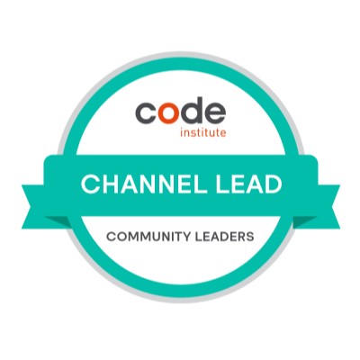

# About me

Hey!

I'm Suzy, I have now completed my Level 5 Diploma with [Code Institute](https://codeinstitute.net/) learning their Full Stack Web Developer course and now I am working in my first Software Engineering role.

I have many years of experience in customer service and have always loved learning new things. 
My goal is to spend my day to day career being involved in something I am passionate about - coding! 
I was a channel lead with [Code Institute](https://codeinstitute.net/) looking after the #project-milestone-1 channel and have conducted webinars on MS1 prep, HTML and CSS challenges and the use of Git. 

## Stack 

- ### **Languages Learned**

          

- ### **Current learning paths**
  

- ### **Future learning paths**

## GitHub statistics

## GitHub Trophies

## Code Institute Badges 

## CodeWars Profile

## Contact me

